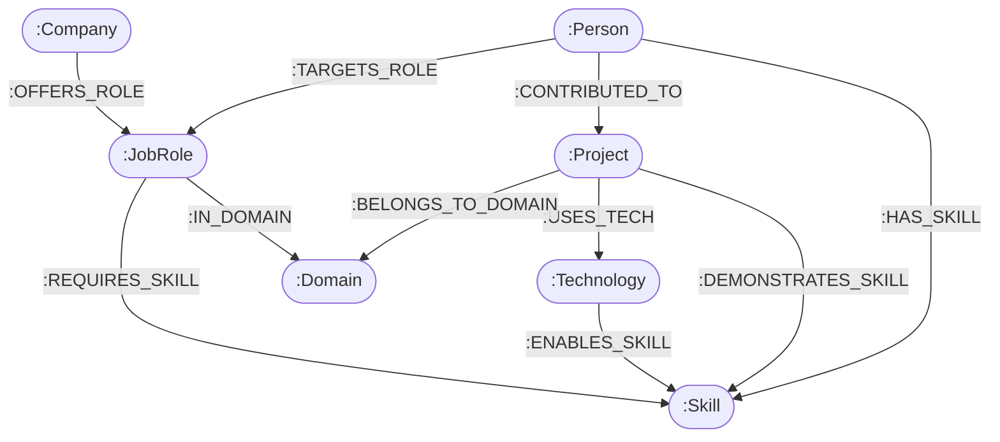

# 🌐 SkillGraph — AI Skill & Career Graph

> **Target Assignment**: Wexa AI Take-Home Assignment  
> **Status**: Implementation Ready | Version 1.0  
> **Core Principle**: Built ground-up around graph relationships using openCypher over Bolt protocol.

SkillGraph is an interactive, graph-native career intelligence application that models relationships between candidates, skills, real-world projects, technologies, job roles, companies, and domains.

---

## 📐 Graph Architecture & Data Schema

### Graph Schema Visual Diagram (Mermaid)



### Labeled Nodes & Typed Relationships

| Entity Node | Description | Key Properties |
| :--- | :--- | :--- |
| `👤 Person` | Candidate / Software Engineer | `id`, `name`, `title`, `bio`, `avatar` |
| `🛠️ Skill` | Professional & AI capability | `id`, `name`, `category`, `demandLevel` |
| `📁 Project` | Real-world project experience | `id`, `name`, `description`, `domain`, `impact` |
| `⚡ Technology` | Software tool or framework | `id`, `name`, `category`, `version` |
| `🎯 JobRole` | Target position / job role | `id`, `title`, `domain`, `tier`, `salaryRange` |
| `🏢 Company` | Hiring employer | `id`, `name`, `industry`, `size` |
| `🌐 Domain` | Technical domain area | `id`, `name`, `description` |

| Relationship Type | Direction | Properties |
| :--- | :--- | :--- |
| `:HAS_SKILL` | `(Person) ➔ (Skill)` | `proficiency` (1-5), `yearsExperience` |
| `:CONTRIBUTED_TO` | `(Person) ➔ (Project)` | `role`, `durationMonths` |
| `:USES_TECH` | `(Project) ➔ (Technology)` | `environment` |
| `:DEMONSTRATES_SKILL` | `(Project) ➔ (Skill)` | `relevanceScore` (0.0-1.0) |
| `:BELONGS_TO_DOMAIN` | `(Project) ➔ (Domain)` | - |
| `:ENABLES_SKILL` | `(Technology) ➔ (Skill)` | - |
| `:REQUIRES_SKILL` | `(JobRole) ➔ (Skill)` | `importance` ('CRITICAL'\|'HIGH'\|'MEDIUM'), `requiredProficiency` |
| `:IN_DOMAIN` | `(JobRole) ➔ (Domain)` | - |
| `:OFFERS_ROLE` | `(Company) ➔ (JobRole)` | - |
| `:TARGETS_ROLE` | `(Person) ➔ (JobRole)` | - |

---

## ❓ Why a Graph Database?

### Why Graph Queries Excel over Relational SQL JOINs for Career Intelligence

In a relational database, representing the connections between people, skills, projects, technologies, and target job roles requires a highly normalized schema with numerous junction tables (`user_skills`, `user_projects`, `project_skills`, `project_tech`, `role_skills`, etc.). 

To answer a simple question like: *"Does candidate **Akhil** have project experience that demonstrates a skill required for target role **Senior Fullstack Engineer**?"*, a relational SQL query requires **6 to 8 JOINs** across separate tables.

*   **Relational (SQL) Bottleneck**: Every additional hop in relational schemas adds exponential JOIN complexity. SQL databases must scan indexes and join tables dynamically at runtime, causing significant CPU overhead and slow response times as the dataset grows. Additionally, the SQL query becomes highly complex and difficult to maintain.
*   **Graph (openCypher) Advantage**: In CognoDB / Neo4j, relationships are stored as direct physical pointers on disk (Index-Free Adjacency). Moving from a `Person` to their `Project`, then to a `Skill`, and back to a `JobRole` is a matter of following memory addresses. Traversal time is proportional to the size of the subgraph being traversed, not the size of the entire database, enabling sub-millisecond multi-hop analysis.

### What SkillGraph Gains with a Graph Schema:
1.  **Multi-Hop Traversal**: Resolving complex paths like `(Person)-[:CONTRIBUTED_TO]->(Project)-[:DEMONSTRATES_SKILL|USES_TECH*1..2]->(Skill)` is trivial and highly performant.
2.  **Graph Recommendation Engine**: Recommending new skills based on co-occurrences of skills across roles: `(Person)-[:HAS_SKILL]->(Skill)<-[:REQUIRES_SKILL]-(JobRole)-[:REQUIRES_SKILL]->(RecSkill)` is computed in a single Cypher query.
3.  **Dynamic Path Finding**: Easily identifying shortest paths or relationship bridges between candidates and opportunities (e.g. `shortestPath((p:Person)-[*..4]-(j:JobRole))`).

---

## 🔍 Key openCypher Queries Explained

### 1. Candidate Project-to-Role Match & Skill Gap Analysis
This query identifies which skills required by a job role are possessed by a candidate, either directly as a listed skill or indirectly through project contributions.
```cypher
MATCH (p:Person {id: $personId}), (j:JobRole {id: $roleId})
MATCH (j)-[rq:REQUIRES_SKILL]->(reqSkill:Skill)
OPTIONAL MATCH (p)-[hs:HAS_SKILL]->(reqSkill)
OPTIONAL MATCH (p)-[:CONTRIBUTED_TO]->(pr:Project)-[:DEMONSTRATES_SKILL|USES_TECH*1..2]->(reqSkill)
RETURN p, j,
       reqSkill,
       rq.importance AS importance,
       rq.requiredProficiency AS requiredProficiency,
       hs.proficiency AS candidateDirectProficiency,
       collect(DISTINCT pr.name) AS verifiedInProjects
```

### 2. Collaborative Skill Recommendation Engine
This query recommends skills that a candidate does not have, but which are required by roles that *do* require skills the candidate already possesses. It scores recommendations by the co-occurrence frequency of these skills across roles.
```cypher
MATCH (p:Person {id: $personId})-[:HAS_SKILL]->(existingSkill:Skill)
MATCH (existingSkill)<-[:REQUIRES_SKILL]-(j:JobRole)-[rq:REQUIRES_SKILL]->(recSkill:Skill)
WHERE NOT (p)-[:HAS_SKILL]->(recSkill)
RETURN DISTINCT recSkill,
                j.title AS connectedRole,
                rq.importance AS importance,
                count(j) AS coOccurrenceScore
ORDER BY coOccurrenceScore DESC
```

### 3. Multi-Hop Path Discovery (Shortest Path)
Finds the shortest network path (up to 4 hops) connecting a candidate to a target job role to reveal indirect career path pathways.
```cypher
MATCH path = shortestPath((p:Person {id: $personId})-[*..4]-(j:JobRole {id: $roleId}))
RETURN path
```

---

## 🚀 Environment Setup & Local Running Guide

### Prerequisites
- Node.js (v18+)
- A CognoDB Cloud instance (or local Neo4j server). *Note: If offline, SkillGraph automatically operates in a Fallback In-Memory Simulator mode using seeded mock data.*

### 1. Set up a CognoDB Cloud Database Instance
To use CognoDB as the live database layer:
1.  **Register an account**: Go to [console.cognodb.com/signup](https://console.cognodb.com/signup) and create an account. No credit card is required.
2.  **Create a free instance**: In the console, spin up a free `c0` instance in your preferred region. It provisions in under 60 seconds.
3.  **Download Connection Secrets**: Copy the connection URI (e.g., `bolt+s://db-xxx.databases.cognodb.cloud`) and save the auto-generated password for the default user `cognodb`. *Note: The password is only displayed once.*
4.  **Configure environment**: Create a `.env` file in the project's root folder using the credentials.

### 2. Environment Configuration (`.env`)
Create a `.env` file in the root directory:
```env
PORT=5000
NEO4J_URI=bolt+s://<your-instance-id>.databases.cognodb.cloud
NEO4J_USER=cognodb
NEO4J_PASSWORD=<your-saved-password>
```

### 3. Installation
Install dependencies for the backend server and frontend client:
```bash
npm install
npm run install-client
```

### 4. Database Seeding
Run the seed script to wipe any previous data and insert our realistic nodes (People, Projects, Skills, JobRoles, Companies, etc.) and relationships using parameterized Cypher queries:
```bash
npm run seed
```

### 5. Running the Web Application
Start both the Express backend server (Port 5000) and the Vite React frontend (Port 3000) concurrently:
```bash
npm run dev
```
Open **http://localhost:3000** in your browser.

---

## 🖥️ User Interface & Dashboard Screens

SkillGraph features a premium, state-of-the-art dashboard styled with a dark theme and glassmorphism aesthetics. It contains the following modules:
1.  **Interactive 2D Graph Canvas**: Renders the complete graph network visually using VisNetwork. Users can zoom, pan, hover, filter nodes by entity type (Person, Skill, JobRole, Project, Technology, etc.), and inspect node properties and edge lists in a slide-out drawer.
2.  **Career Compatibility Matcher**: Computes a compatibility percentage score for any selected candidate and target job role. Displays acquired skills, missing skill gaps labeled by importance (Critical/High/Medium), and project-based verification evidence.
3.  **AI Graph Skill Recommender**: Runs collaborative graph recommendation queries to list the highest impact skills a candidate should acquire next.
4.  **openCypher Query Playground**: A sandbox console allowing developers to enter custom Cypher queries, execute them directly against the database (or simulator), and inspect structured JSON results with execution timings.

---

## 📁 Repository Structure

```
skill-graph/
├── server/
│   ├── db.js             # Neo4j/Bolt driver connection & fallback graph engine
│   ├── seedData.js       # Seed dataset (People, Skills, Projects, Tech, Roles)
│   ├── seed.js           # openCypher seed execution script
│   ├── routes/
│   │   └── graphRoutes.js # Graph REST API endpoints & Cypher query handler
│   └── index.js          # Express server entrypoint
├── client/
│   ├── src/
│   │   ├── components/
│   │   │   ├── Navbar.jsx            # Brand header & CognoDB connection pill
│   │   │   ├── GraphCanvas.jsx       # Interactive 2D vis-network canvas
│   │   │   ├── RoleMatcher.jsx       # Multi-hop role match & gap analysis
│   │   │   ├── Recommendations.jsx   # Graph skill recommendation hub
│   │   │   ├── CypherPlayground.jsx  # openCypher query editor & viewer
│   │   │   └── InspectorPanel.jsx    # Entity detail drawer
│   │   ├── App.jsx                   # Main layout container
│   │   └── index.css                 # Dark mode & glassmorphism theme
│   ├── index.html
│   └── vite.config.js
├── .env.example
├── package.json
└── README.md
```

---

## 🛡️ License
Distributed under the ISC License. Built for Wexa AI Take-Home Assessment.
